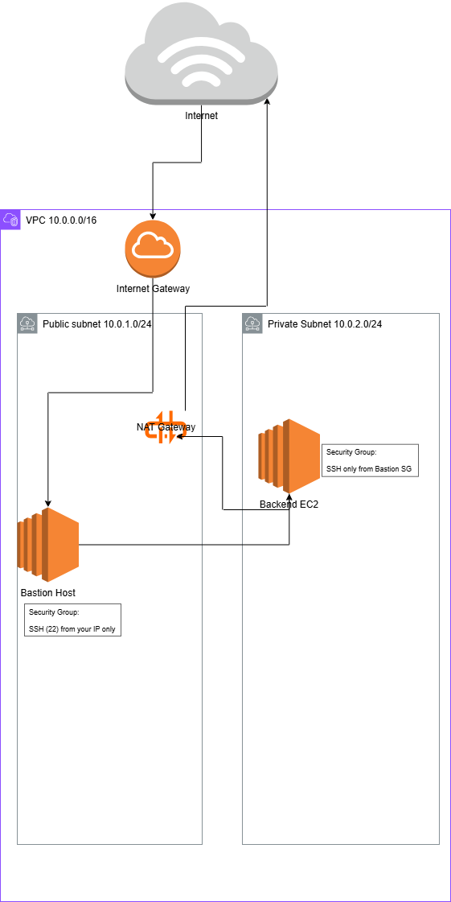

# aws-cloud-portfolio

This repository contains a production-style AWS environment deployed entirely using Infrastructure-as-Code (CloudFormation).

It demonstrates how to securely operate backend services in private subnets while allowing controlled administrative access through a bastion host — a common pattern in real-world cloud environments.

##Architecture
This project deploys a two-tier AWS architecture inside a dedicated VPC.

The environment includes:
- Two public subnets
- Two private subnets
- An Internet Gateway for inbound traffic
- A NAT Gateway for private subnet outbound access
- A Bastion Host EC2 in a public subnet
- A Backend EC2 instance in a private subnet

The backend server is intentionally not exposed to the internet. All administrative access flows through the bastion host, enforcing a secure access boundary.

##Security Model
Security is enforced at multiple layers:

- The Bastion Host security group only allows SSH (22) from my IP
- The Private EC2 instance has no public IP
- The Private EC2 security group only allows SSH from the Bastion Host’s security group
- The private subnet routes outbound traffic through a NAT Gateway

This ensures the backend system cannot be reached directly from the internet while still allowing controlled administration and outbound connectivity.

##Deployment and Validation
The entire environment is deployed using CloudFormation templates located in the infra/ directory.

To deploy:
aws cloudformation deploy --template-file main.yaml --stack-name secure-two-tier --capabilities CAPABILITY_NAMED_IAM

After deployment:
- The bastion host receives a public IP
- The private EC2 instance is reachable only through the bastion
- Direct SSH access to the private EC2 from the internet fails as expected

##Cost Awareness
When you are finished using the stack resources, all resources can be removed by deleting the CloudFormation stack, ensuring no ongoing charges. 

##What I learned
This project gave me hands-on experience with:

- Designing secure AWS network topologies
- Implementing bastion-based access patterns
- Deploying private workloads using NAT Gateways
- Writing and troubleshooting CloudFormation templates
- Validating access controls in a live AWS environment

##Next Steps
Future improvements:
- Add Application Load Balancer
- Add Auto Scaling Group
- Add CI/CD pipeline
- Convert infrastructure to Terraform

## Architecture Diagram

